# 5：実際のシステム開発の流れ

[前ページ(4：システム開発する際の考え方)](./4-01.md)　｜　[目次へ戻る](./index.md)
- - -

ここではシステム開発の実際の流れを説明します。

- [5-1：要件定義（仕様決め）](#5-1要件定義仕様決め)
- [5-2：概要設計（外部設計）](#5-2概要設計外部設計)
- [5-3：詳細設計（内部設計）](#5-3詳細設計内部設計)
- [5-4：実装（コーディング）](#5-4実装コーディング)
- [5-5：単体試験（単体テスト）](#5-5単体試験単体テスト)
- [5-6：結合試験（結合テスト）](#5-6結合試験結合テスト)
- [5-7：総合試験（総合テスト）](#5-7総合試験総合テスト)
- [5-8：システムの「品質」](#5-8システムの品質)
- [5-9：システム開発のモデル](#5-9システム開発のモデル)
- [5-10：余談](#5-10余談)

## 5-1：要件定義（仕様決め）

お客様との打ち合わせや話し合いで`仕様`を決めます。

3-1や4-1で既に書いたように`お客様が抱えている問題を解決`するのが最大の目的であるので、そこを正確に理解する必要があります。

そして`目的の明確化`をし、`仕様書`を作成します。

この要件定義の段階では、お客様とのコミュニケーションが重要となってきます。

## 5-2：概要設計（外部設計）

仕様が決まったら次は`概要設計`を行います。

4-2で書いたように`要素の細分化`を行って仕様をより具体的な要素に分け、それを元にシステム全体の構成やファイル分け、使用するフレームワークやライブラリなどを決めていきます。

そしてそれらを`概要設計書`として起こしてきます。

## 5-3：詳細設計（内部設計）

概要設計を更に細かく`要素の細分化`を行ったものが`詳細設計`です。

プロジェクトによって詳細設計書に書く内容はまちまちですが、関数名とその中に記述する処理をフローチャートや日本語で記す場合もあります。

概要設計よりも`コーディングする際の細かい内容を記したもの`が`詳細設計書`になります。

## 5-4：実装（コーディング）

詳細設計まで終わったらコーディングを行っていきます。

3-2で書いたように、`各設計書や仕様書を正確に読み込んでソースコードに落とし込む`ようにしてください。

## 5-5：単体試験（単体テスト）

コーディングが終わったらちゃんと仕様や設計通りに動くかをチェックします。単体試験を行う単位は基本的にには`ファイルやクラス単位`になります。

単体試験を行う前には必ず`単体試験で何を行うか`を記した`単体試験項目書`を作成します。試験の内容を決めずに行った場合、無駄な試験をやってしまったり、逆に必要な試験が抜けてしまったりします。なので必ず`単体試験項目書を作成してから単体試験を行う`ようにしてください。

単体試験は基本的には`ホワイトボックステスト`で行うことが多いです。

詳しくは各自で調べて欲しいのですが、ホワイトボックステストを簡単に言うと`ソースコードの中身がわかっている状態でソースコードの全てを通したテスト`のことを言います。

例えば以下のようなコードがあったとします。

~~~python
if a == b and b == c:
  return "equal"
else:
  return "not equal"
~~~

このコードで`aとbとcが全て同じ値`として実行すると`equal`の結果が得られますが、判定でelseにはならないためelse以下の`not equal`のコードは実行されていません。またifの条件文も全ての条件の場合を試す必要があります。

これらのことから短いコードですが、条件のパターンを考えるとこれだけ試験をして確かめる必要があります。

- aとbとcが全て同じ値(結果はequal)
- aとbが同じ値でcのみ違う値(結果はnot equal)
- bとcが同じ値でaのみ違う値(結果はnot equal)
- aとcが同じ値でbのみ違う値(結果はnot equal)
- a, b, cが全て違う値(結果はnot equal)

慣れていない内は試験のパターンを考えるのは難しいとは思いますが、どのようなパターンがあるかをしっかり考えて試験項目を作っていくようにしてください。

また`詳細設計書`と対応するはずなので`詳細設計書`の内容から試験項目を起こす場合もあります。

## 5-6：結合試験（結合テスト）

単体試験が終わったら次は`結合試験`を行います。結合試験を行う単位は基本的にには`機能やモジュール単位`になります。

結合試験でも単体試験の時と同様に`結合試験項目書`を作成します。

結合試験では基本的には`ブラックボックステスト`で行います。

こちらも詳しくは各自で調べて欲しいのですが、ブラックボックステストはホワイトボックステストの反対で`ソースコードの中身がわからない状態でのテスト`のことを言います。

結合試験は`単体試験完了後に行う`ので`ファイル、クラス単位でのバグは解消されている`という前提になっています。

なので基本的には`クラス間のデータのやり取り`などに重点を置いた試験内容になります。

具体的には結合試験で行う機能の内での正常系(正常に処理が行われるパターンなど)や異常系(エラーメッセージを出すパターンなど)についての試験を行います。

単体試験でバグが解消していれば結合試験は全て問題なく進むと思うかもしれませんが、別のクラスに渡すデータのフォーマットが設計段階で間違っていたり、想定していなかった値が渡されていたりなど、実際に他クラスなどと一緒に動かしてみないとわからないことも多いです。

なのでここでもしっかりと試験パターンを考えて試験項目を作るようにしましょう。

また`概要設計書`と対応するはずなので`概要設計書`の内容から試験項目を起こす場合もあります。

## 5-7：総合試験（総合テスト）

結合試験が終わったら最後の`総合試験`に移ります。`仕様通りに動くか`を試験する最終試験となります。総合試験でも`総合試験項目書`を作成します。

この総合試験はお客が立ち会う場合もあります。

総合試験では`実際に使用される場合を想定した流れ`で試験を行います。この実際に使用される場合を想定した流れを`シナリオ`と言ったりします。なので`シナリオ試験`と呼ばれる場合もあります。

このシナリオも実際に使用が想定される条件毎に作成し、そのシナリオ毎に試験を行います。

この総合試験を全て正常に終えたことで初めて`システムが完成した`ということになります(※実際にはこの後お客様側で`受入検査`と呼ばれる工程がありますがそれはシステム開発側はどうすることもできないので割愛します)。

## 5-8：システムの「品質」

要件定義～総合試験までのシステム開発の流れをざっと説明してきましたが、単体試験～総合試験までの`試験`の内容でシステムの`品質`が決まります。

システムの品質とは`仕様通りに動きバグがないシステム`が`品質が高い`と言えます。

逆に`仕様とは違う動きをしたりバグが多いシステム`は`品質が低い`です。

システムにはバグがつきもので、そのバグをゼロにすることはできません。ですが、そのバグを`限りなくゼロに近づけることは可能`です。

そのバグを限りなくゼロに近づけるために`必要な試験が抜けなく実施できているか`が重要になってきます。

実際に開発をしているとバグは必ず出ます。むしろ試験の段階でバグが一切出ないような場合は`試験パターンが足りない`と思った方が良いです。

むしろ`試験段階でバグを出し切る`ぐらいの気持ちで試験項目書を作るのが、高い品質に繋がると思います。

## 5-9：システム開発のモデル

システム開発の流れとしてよく使われるものとして、以下のようにV字モデルというのがあります。

各工程の内容を読んでいれば理解できるかと思いますが、要件定義は総合試験、概要設計は結合試験、詳細設計は単体試験に対応する形となっています。

なのでそれぞれの試験の時にはそれぞれの設計書や仕様書も確認するようにしましょう。

## 5-10：余談

システム開発の手法として`ウォーターフォール開発`や`アジャイル開発`を聞いたことがある人もいるかと思います。

「ウォーターフォールは古くいけてない手法でアジャイルの方がよい」という言説がありますが、ウォーターフォールもアジャイルもどちらも本質的には今回説明した順番で開発していくのは変わりません。

ウォーターフォールを規模を小さくして短い期間にこなしていくのがアジャイルと言っても間違いではないです。なのでアジャイルを採用したからと言って、プロジェクトが炎上しないということにはなりません。

`目的は何か`を理解して`目的を達成できるシステムを作る`のがシステム開発の本質です。なので自分がここまで説明してきた手法や用語などは本質的にはどうでもよいです。

手法や用語に囚われることなく、本当の意味で`システム開発`を行える方法論を自分の中で確立するようにしてください。そしてプロジェクトが終わればその内容を振り返り、次のプロジェクトでは振り返りを生かした開発をしてください。そうすれば自然とシステム開発ができるようになっていきます。

- - -
[前ページ(4：システム開発する際の考え方)](./4-01.md)　｜　[目次へ戻る](./index.md)
- - -